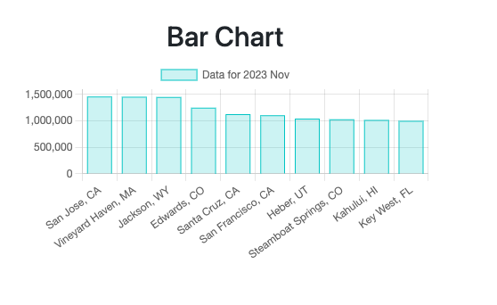
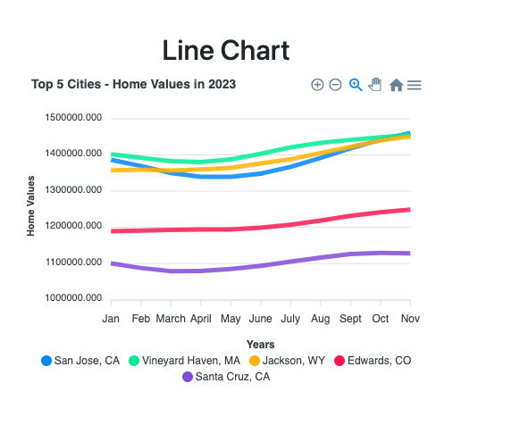

## US Home Values Visualization
## Overview
- This project presents visualizations of home values across the United States using home value data as of November 2023. Utilizing Chart.js and ApexCharts, we illustrate both the current market snapshot and the trends over the past year.

## Contributors
- Cynthia Saving
- Molly Delehant
- Nathan Rosenberg
- Sean Bell
- Shunjia Liu

## Data Preparation
- The dataset comprises home value information sorted as of November 2023. Initial visualizations are prepared for the top 10 cities by home value for a bar chart representation, and the top 5 cities for a line chart that tracks home value trends throughout the year. Initial data contained over 22,000 rows for various states throughout the nation.

## Visualizations
## Chart 1 (Using Chart.js Bar Chart)

- **Chart Type:** Bar Chart 
- **Data Displayed:** Home values of the top 10 cities as of 2023-11-30.
- **Order:** The cities are displayed in descending order based on home values.
- **Purpose:** This chart provides a clear visual representation of the home values for the top regions as of November 2023.
## Chart 2 (Using ApexCharts Line Chart)

- **Chart Type:** Line Chart
- **Data Displayed:** Home values of the top 5 cities throughout the months of 2023.
- **Order:** The data is ordered chronologically to show home value trends.
- **Purpose:** The line chart captures the fluctuations in home values over time, providing insights into the market dynamics for the top 5 cities.

## Data Enhancement
- A new column, Sum2023, has been calculated and added to the dataset, representing the sum of values for each city over the months of 2023.
- This offers an additional aggregated perspective on the home value data.

## Chart Descriptions
### Chart.js Bar Chart
- Represents home values for the top 10 regions in November 2023.
- The bars are arranged in descending order for immediate comprehension of the data.
- Acts as a quick reference to understand the latest market trends.

## ApexCharts Line Chart:
- Showcases home value trends of the top 5 cities for the year 2023.
- The line graph elucidates the monthly progression and potential market predictions.
- Aids in analyzing the market momentum and investment opportunities.

## Getting Started
- To view the visualizations, simply open the HTML files in your browser:
- chartjs-bar-chart.html for the bar chart visualization using Chart.js.
- apexcharts-line-chart.html for the line chart visualization using ApexCharts.
- Ensure that you have internet access while opening these files as the chart libraries may need to be fetched from a CDN.

## Contributing
- Contributions to this project are welcome. To contribute:
- Fork the repository.
- Create a new branch for your feature (git checkout -b feature/AmazingFeature).
- Commit your changes (git commit -m 'Add some AmazingFeature').
- Push to the branch (git push origin feature/AmazingFeature).
- Open a pull request.
- License
- Distributed under the MIT License. See LICENSE for more information.
- Contact
- Your Name - your-email@example.com
- Project Link: https://github.com/yourusername/project-name

